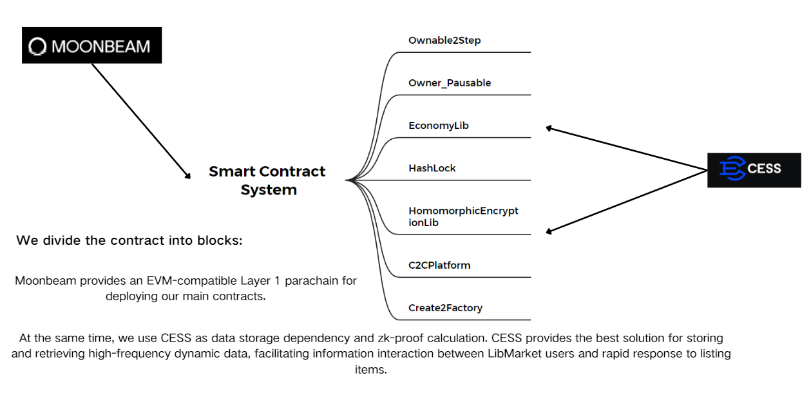
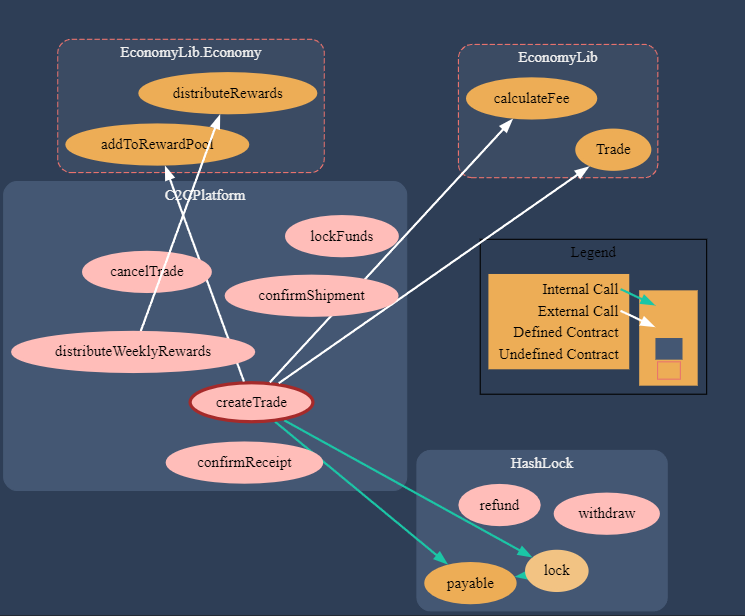

# LibMarket

## Introduction

LibMarket aims to explore the possibility of decentralized e-commerce platforms, uses Polkadot's relay chain and parachain architecture to achieve interoperability between different blockchains, support cross-chain asset transactions and data exchange, and through this feature of Polkadot, realize a Defi platform with free transactions based on C2C mode, aiming to provide a free trade market system.
Relying on the shared security mechanism of Polkadot's relay chain, using homomorphic encryption algorithm to ensure the security of information, buyers and sellers can communicate directly and securely. Different from the current traditional transaction model of "sellers set prices and buyers seek to purchase NFTs", we have targeted all items under the chain, including entities, and negotiated on the off-chain platform-guaranteed transactions on the chain without the need for third-party trust. This has realized a new market model in which buyers and sellers can communicate and set prices.

## Features planned for the Hackathon

- [x] Use hash locks to ensure the time validity of transaction orders, and introduce a tree-like mapping relationship between a single seller and multiple buyers.

- [x] Added a market master switch to set the market's opening and closing trading hours. Make it more flexible

- [x] After the buyer requests the seller's consent, the buyer requests a signature, without the need for off-chain trust

- [x] Adopt zk-proof-homomorphic encryption algorithm to ensure the security of signature confirmation between buyers and sellers

- [x] The economic model is introduced, and 100% of the transaction fees are paid to active buyers and sellers. A points system is also introduced, which can be used to exchange for physical objects.

- [x] Introducing other ecosystems through Polkadot's parallel chain architecture, shopping cart and other functions are implemented using sui

- [ ] Implement the product listing/removal function, and the on-chain status relationship after the transaction is completed to make it logical and prevent abuse

- [ ] Item reviews, buyers rate sellers on the chain and introduce a points model

## Architect

#### Overall architecture

#### Smart Contract Architecture

```mermaid
flowchart TD
    %% Users interacting with the system
    Buyer((Buyer)) -->|Create Trade| C2CPlatform
    Seller((Seller)) -->|Lock Funds| C2CPlatform

    %% Core contract logic
    C2CPlatform -->|Pending| TradeStatePending{{Pending State}}
    C2CPlatform -->|Locked| TradeStateLocked{{Locked State}}
    C2CPlatform -->|Shipment Confirmed| TradeInProgress{{In Progress}}
    C2CPlatform -->|Complete| TradeComplete{{Complete State}}
    C2CPlatform -->|Cancelled| TradeCancelled{{Cancelled State}}

    %% Functions associated with the contract
    subgraph Contract Functions
        C2CPlatform --> CreateTrade
        C2CPlatform --> LockFunds
        C2CPlatform --> ConfirmShipment
        C2CPlatform --> ConfirmReceipt
        C2CPlatform --> CancelTrade
        C2CPlatform --> DistributeWeeklyRewards
    end

    %% Events associated with functions
    CreateTrade -->|Event| TradeCreatedEvent((TradeCreated))
    LockFunds -->|Event| TradeLockedEvent((TradeLocked))
    ConfirmShipment -->|Event| TradeConfirmedEvent((TradeConfirmed))
    ConfirmReceipt -->|Event| TradeConfirmedEvent
    CancelTrade -->|Event| TradeCancelledEvent((TradeCancelled))
    DistributeWeeklyRewards -->|Event| RewardDistributedEvent((RewardDistributed))

    %% Pausable mechanism
    subgraph Pausable Mechanism
        PausableControl --> PauseContract((Pause Contract))
        PausableControl --> UnpauseContract((Unpause Contract))
        C2CPlatform --> PausableControl
    end

    %% HashLock mechanism
    subgraph HashLock Mechanism
        HashLock --> LockFundsProcess((Lock Funds))
        HashLock --> WithdrawFundsProcess((Withdraw Funds))
        HashLock --> RefundProcess((Refund))
    end

    %% Ownership and Pause Control
    subgraph Inherited Contracts
        Ownable2Step --> C2CPlatform
        Pausable --> C2CPlatform
    end

    %% Economic Model
    subgraph Economic Model
        EconomyLib --> CalculateFee((Calculate Fee))
        EconomyLib --> AddToRewardPool((Add to Reward Pool))
        EconomyLib --> DistributeRewards((Distribute Rewards))
        EconomyLib --> TradeCounter((Trade Counter Management))
    end
    
    %% Economy workflow
    CreateTrade -->|Collect Fee| CalculateFee
    CalculateFee --> AddToRewardPool
    AddToRewardPool --> DistributeRewards
    DistributeRewards -->|Reward Seller and Buyer| TradeComplete

    %% Create2Factory Contract
    subgraph Create2Factory Mechanism
        Create2Factory --> DeployContract((Deploy Contract))
        Create2Factory --> GetAddress((Get Address))
        Create2Factory --> GetBytecode((Get Bytecode))
    end
    
    %% Link Create2Factory to Main Contract
    DeployContract --> C2CPlatform

```

#### The reserved interface plans to add other ecological model instances

```mermaid
flowchart TD
    %% 用户交互
    Buyer((Buyer)) -->|Add to Cart| ShoppingCart
    Buyer -->|Remove from Cart| ShoppingCart
    Buyer -->|View Total Price| ShoppingCart

    %% 购物车功能
    ShoppingCart((Shopping Cart)) -->|Initialize Cart| InitCart
    ShoppingCart -->|Add Item| CreateItem
    ShoppingCart -->|Remove Item| RemoveItem
    ShoppingCart -->|Get Total Price| GetTotalPrice

    %% 商品管理
    Seller((Seller)) -->|Create Goods| Listings
    Seller -->|Add Goods| Listings
    Seller -->|View Goods| Listings

    %% 商品和卖家
    Listings((Listings)) -->|Create Goods| CreateGoods
    Listings -->|Get Goods Name| GetGoodsName
    Listings -->|Get Goods Information| GetGoodsInformation
    Listings -->|Get Goods Price| GetGoodsPrice

    %% 结构和对象
    subgraph ShoppingCart Module
        Cart((Cart)) -->|Items| ItemsVector
    end

    subgraph Listings Module
        Goods((Goods)) -->|Name| NameField
        Goods -->|Information| InformationField
        Goods -->|Price| PriceField
    end

```

## Schedule

| Phase                  | Description |
| ---------------------  | ----------- |
| Order message validity | Use hash locks to limit the order validity date and add mapping status to match it |
| Market Mode | The market adopts the CToC model, and any user can be a buyer or a seller |
| Fully on-chain trust notes | It provides a communication platform for buyers and sellers but without off-chain trust relationship, giving buyers on-chain bargaining power as the only proof. |
| Economic and Integral Models | An incentive system is used to build an economic and points model, and the handling fees are added to the total reward pool and distributed to buyers and sellers. |
| ZK-Proof Verification | Use homomorphic encryption algorithm to ensure the security of message transmission and consistency between buyers and sellers |
| Supply and demand | There is a situation where there is a single seller and multiple buyers. The seller decides the final price. After the decision is made, the buyer signs and initiates the order. |

## Team info
| Name    | Role              | GitHub/X    |
| ------- | ----------------- | ----------- |
| S7iter  | PM&Full stack dev | S7iter      |
| Ch1hiro | backend dev       | Ch1hiro4002 |
| Azhan   | CD&Code Auditor   | Azhan1431   |
|LittleNewbie| Front Dev      | XiaoLiisnotwritingbugs |
| UPON | Blockchain architecture and cryptography expert | UPON-2021 |

## Material for Demo
1. Demo Video [link to Youtube]
2. PPT [link to google doc]

